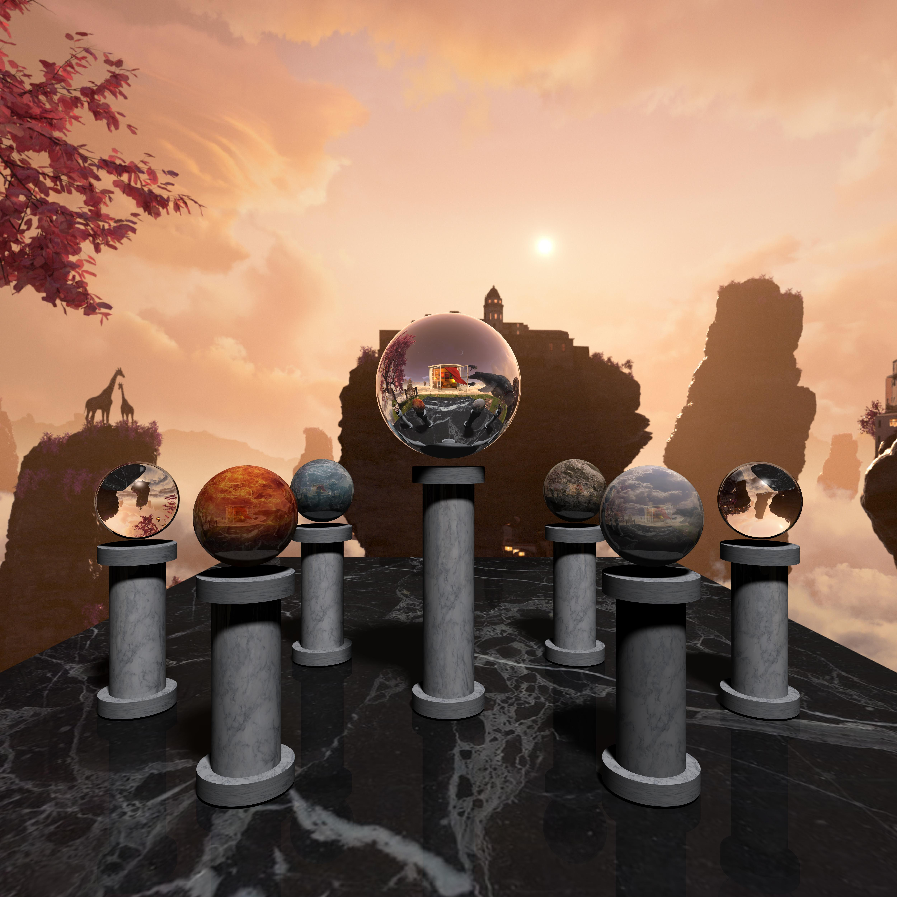

# Ray-Tracer

My final project for CSC418 (Computer Graphics) at the University of Toronto was to create a ray tracer using C++ and render a scene.

Basic funcionalities implemented include:
- Ray casting - Compute ray for each pixel to determine pixel colour
- Ray-Sphere and Ray-Plane intersections
- Phong Illumination - Calculate the ambient, diffuse, and specular components
- Shadows
- Reflection using recursive ray casting

After implementing the above functionality, the following extensions were added:
- Anti-aliasing
- Multithreading
- Area light sources
- Ray-Cylinder intersections
- Texture mapping
- Environment mapping
- Refraction

See the below image for the final render.

